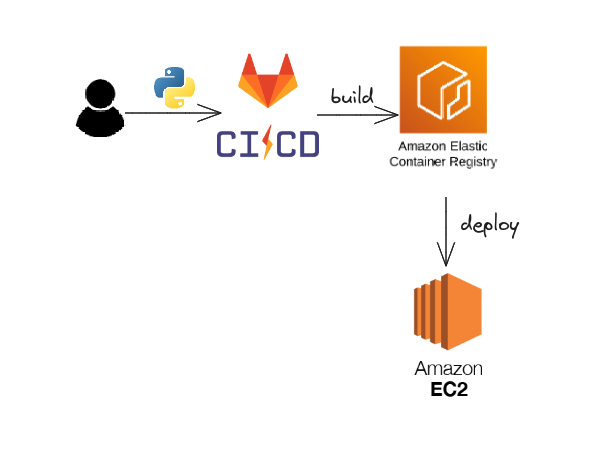

# Build Python with Dockerfile

## Documentation for this lab
Check out my blog on Medium for more information: [My Medium Blog](https://medium.com/aws-tip/learning-gitlab-ci-cd-workflow-hands-on-lab-with-aws-ecr-and-ec2-7759f103d368)

## System Design

Here is the system design of the project:



```bash
~$docker build -t pyyapp .
~$docker ps
~$docker run -p 80:8080 pyyapp -d
```

Then access from browser

[http://localhost:80]

